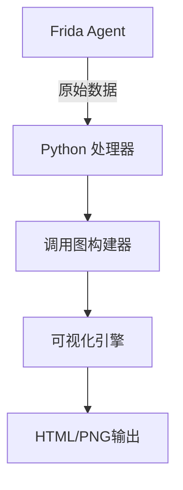

# Frida Call Graph 项目上下文

## 项目目标
创建自动化的函数调用追踪系统，通过Frida hook目标应用，生成交互式调用关系图

## 核心组件


## 关键文件说明
1. `agents/core-tracer.js` - Frida hook核心脚本
   - 使用Interceptor.attach追踪函数
   - 通过send()发送调用事件
   
2. `core/tracer.py` - Python端Frida控制器
   ```python
   def on_message(message, data):
       if message['type'] == 'send':
           handle_call_event(message['payload'])
   ```

3. `core/graph_builder.py` - 图关系处理器
   - 使用NetworkX构建有向图
   - 支持动态更新节点关系

## 开发规范
1. **Python部分**:
   - 使用asyncio处理异步消息
   - 类型注解强制要求
   - 日志统一使用structlog

2. **JavaScript部分**:
   - 符合ES2020标准
   - 模块化设计（export/import）
   - 添加JSDoc类型注释

## 当前重点任务
// 由开发者根据当前工作添加具体说明
// 示例：
正在实现动态过滤模块，需要添加基于正则表达式的函数名匹配功能
在graph_builder.py中优化大型图数据的处理性能

## 常用命令
```bash
# 启动追踪
python main.py -p com.android.chrome

# 更新agents
adb push agents/* /data/local/tmp

# 生成文档
python utils/generate_docs.py
```

## 架构约束
1. 保持agents与core的解耦
2. 可视化层不直接访问原始数据
3. 配置驱动设计（YAML/JSON）